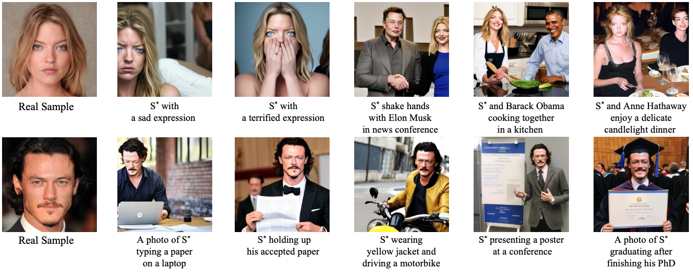
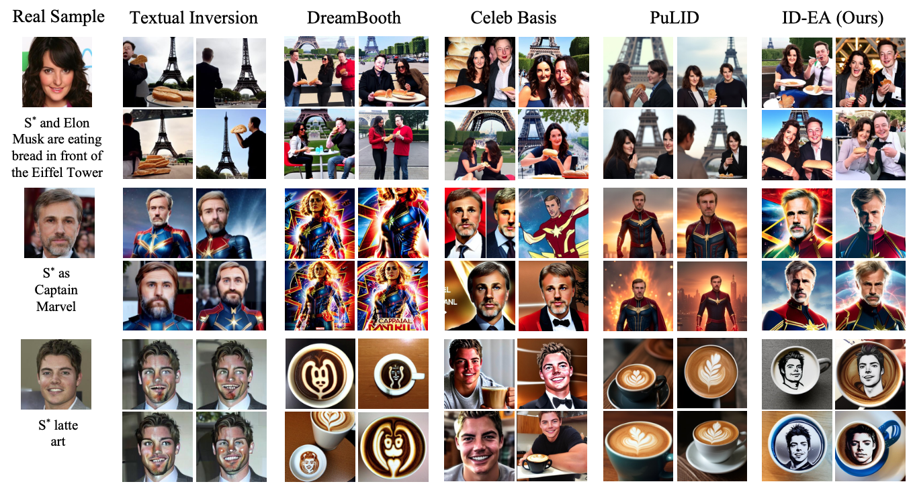

# ID-EA (SMC conference 2025)

Official Implementation of **"ID-EA: Identity-driven Text Enhancement and Adaptation with Textual Inversion for Personalized Text-to-Image Generation"** by Hyun-Jun Jin, Young-Eun Kim, and Seong-Whan Lee.

## Abstract
>   Recently, personalized portrait generation with a text-to-image diffusion model has significantly advanced with Textual Inversion, emerging as a promising approach for creat- ing high-fidelity personalized images. Despite its potential, cur- rent Textual Inversion methods struggle to maintain consistent facial identity due to semantic misalignments between textual and visual embedding spaces regarding identity. We introduce ID-EA, a novel framework that guides text embeddings to align with visual identity embeddings, thereby improving identity preservation in a personalized generation. ID-EA comprises two key components: the ID-driven Enhancer (ID-Enhancer) and the ID-conditioned Adapter (ID-Adapter). First, the ID- Enhancer integrates identity embeddings with a textual ID anchor, refining visual identity embeddings derived from a face recognition model using representative text embeddings. Then, the ID-Adapter leverages the identity-enhanced embedding to adapt the text condition, ensuring identity preservation by adjusting the cross-attention module in the pre-trained UNet model. This process encourages the text features to find the most related visual clues across the foreground snippets. Extensive quantitative and qualitative evaluations demonstrate that ID-EA substantially outperforms state-of-the-art methods in identity preservation metrics while achieving remarkable computational efficiency, generating personalized portraits ap- proximately 15 times faster than existing approaches.


<a href="http://arxiv.org/abs/2507.11990"></a>

## Update
+ **2025.7.28**: Code released!

## Setup
Our code mainly bases on [Diffusers-Textual Inversion](https://github.com/huggingface/diffusers/tree/main/examples/textual_inversion) and relies on the [diffusers](https://github.com/huggingface/diffusers) library.

To set up the environment, please run:
```
conda create -n ci python=3.10
conda activate ci

pip install -r requirements.txt
```

## Dataset
### Image Dataset
We use CelebA dataset to test our method, which can be downloaded from [here](https://mmlab.ie.cuhk.edu.hk/projects/CelebA.html).

We also provide some images for testing in `./examples/input_images`, which are also from CelebA.

### Celeb Name Dataset
The Celeb names in `./examples/wiki_names_v2.txt` used in this project are from [Celeb Basis](https://github.com/ygtxr1997/CelebBasis/tree/main). We are very grateful for their contributions.

## Usage



### Training
You can simply run the `train.py` script and pass the parameters to train your own result.

For example, to train the identity in `./examples/input_images/01556`, you can run:
```
python train_arcross_adapter_kv.py     --save_steps 100      --only_save_embeds     --placeholder_token "<00011>"     --train_batch_size 8    --scale_lr    --n_persudo_tokens 2    --reg_weight "8e-4"   --learning_rate 0.0015     --max_train_step 320   --train_data_dir "./examples/input_images/00011"    --celeb_path "./examples/wiki_names_v2.txt"     --pretrained_model_name_or_path "stabilityai/stable-diffusion-2-1-base"     --output_dir "./logs/00011/learned_embeddings"
```
Please refer to `train.py` for more details on all parameters.

### Inference
To run inference on a learned embedding, you can run:
```
python test.py  --pretrained_model_name_or_path "stabilityai/stable-diffusion-2-1-base" --num_inference_steps 50 --learned_embedding_path "/home/prml/Jin/Main/logs/00011/learned_embeddings/learned_embeds.bin"  --prompt "{} wearing an oversized sweater" --save_dir "./logs/00011/images"  --num_images_per_prompt 32  --n_iter 1
```
**Note:**

+ We provide learned embeddings in `./examples/learned_embeddings` for anyone who wants to directly experiment with our methods.
+ For convenience, you can either specify a path to a text file with  `--prompt_file`, where each line contains a prompt. For example:
    ```
    A photo of a {} person
    A {} person eating bread in front of the Eiffel Tower
    A {} person latte art
    ```
+ The identity placement should be specified using `{}`, and we will replace `{}` with the identity's placeholder token that is saved in the learned embedding checkpoint.
+ The generated images will be saved to the path `{save_dir}/{prompt}`

Please refer to `test.py` for more details on all parameters.

## Metrics
We use the same evaluation protocol as used in [Celeb Basis](https://github.com/ygtxr1997/CelebBasis/tree/main).

## Acknowledgements
Our code mainly bases on [Diffusers-Textual Inversion](https://github.com/huggingface/diffusers/tree/main/examples/textual_inversion), and the celeb names used in this project are from [Celeb Basis](https://github.com/ygtxr1997/CelebBasis/tree/main). A huge thank you to the authors for their valuable contributions.

## References

```
@article{jin2025id,
  title={ID-EA: Identity-driven Text Enhancement and Adaptation with Textual Inversion for Personalized Text-to-Image Generation},
  author={Jin, Hyun-Jun and Kim, Young-Eun and Lee, Seong-Whan},
  journal={arXiv preprint arXiv:2507.11990},
  year={2025}
}
